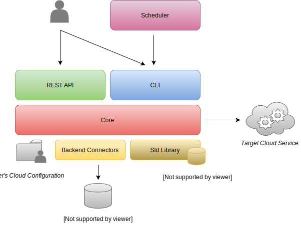

.. Benchmarking Suite
.. Copyright 2014-2017 Engineering Ingegneria Informatica S.p.A.

.. Licensed under the Apache License, Version 2.0 (the "License");
.. you may not use this file except in compliance with the License.
.. You may obtain a copy of the License at
.. http://www.apache.org/licenses/LICENSE-2.0

.. Unless required by applicable law or agreed to in writing, software
.. distributed under the License is distributed on an "AS IS" BASIS,
.. WITHOUT WARRANTIES OR CONDITIONS OF ANY KIND, either express or implied.
.. See the License for the specific language governing permissions and
.. limitations under the License.

.. Developed in the ARTIST EU project (www.artist-project.eu) and in the
.. CloudPerfect EU project (https://cloudperfect.eu/)

#################
Architecture
#################

The Benchmarking Suite is composed by five main components summarized in the following diagram:

- **Core**: defines the main model, the extension framework for the benchmarks and the Cloud providers and the main data representation types;
- **REST**: a REST server to access all the Benchmarking Suite functionalities;
- **CLI**: a command line tool (bash-compatible) to access all the Benchmarking Suite functionalities;
- **Std Library**: a set of selected benchmark tools, including their configurations and the implementation of the required wrapping scripts for the execution and the parsing of results;
- **Backend Connectors**: a set of connectors to store the Benchmarking Suite executions results on different storage technologies (e.g. MySQL, MongoDB).

The *Core* component is the only required component, the other components are optional. However the Benchmarking Suite installation will miss the functionalities of not-installed modules (e.g. if the *Backend Connectors* is not installed, the execution results will not be stored).

The *User's Cloud Configuration* is the required configuration of the Cloud Providers that the Benchmarking Suite needs to be able to access the *Target Cloud Provider*. It can be specified either as configuration file or as parameter in the execution requests (through the REST or CLI components). Refer to section :doc:`providers` for further details

Design
======

.. in this section we are using the https://yuml.me/ service to generate UML diagrams on the fly providing the description of the diagram in the URL directly. We split the URL in different lines to improve the readability

The Benchmarking Suite is designed to be very generic and extensible. The main concept is the **BenchmarkExecution** that is the execution of a **Benchmark** in one **ExecutionEnvironment** provided by a **ServiceProvider**.

With this concepts, it is easy to model, for instance, the execution of the *YCSB* benchmark on a *Virtual Machine* provided by *Amazon AWS*.

.. image:: https://yuml.me/diagram/scruffy;dir:TB/class/
                [ExecutionEnvironment]0..*-1[ServiceProvider],
                [BenchmarkingExecution]0..*-1[Benchmark],
                [BenchmarkingExecution]1..*-1[ExecutionEnvironment]
    :align: center

Since it is frequent to execute multiple tests against the same Service Provider, the Benchmarking Suite has the concept of **BenchmarkingSession**. that can include one or more executions of the same provider.

.. image:: https://yuml.me/diagram/scruffy;dir:TB/class/[BenchmarkingSession]-1..*[BenchmarkingExecution],[BenchmarkingSession]-1[ServiceProvider],[BenchmarkingExecution]-[ExecutionEnvironment],[ExecutionEnvironment]-1[ServiceProvider].png
    :align: center

By default, all the executions of the same session share the same **ExecutionEnvironment**.

Software Modules
================

In order to address all the different use cases and the installation necessities, the Benchmarking Suite is distributed in five different software modules that can be installed separately:

+-----------------------+--------------------------------------------------------------------------------+
| ``benchsuite.core``   | the core library (all other  modules depend on it) with the definition of      |
|                       | types and the fundamental framework for the extension of the Benchmarking      |
|                       | Suite                                                                          |
+-----------------------+--------------------------------------------------------------------------------+
| ``benchsuite.stdlib`` | a collection of benchmark tests configuration files and support for some Cloud |
|                       | Providers                                                                      |
+-----------------------+--------------------------------------------------------------------------------+
| ``benchsuite.cli``    | a bash command line tool to manage tests and results                           |
+-----------------------+--------------------------------------------------------------------------------+
| ``benchsuite.rest``   | an HTTP server and a REST API to interact with the Benchmarking Suite          |
+-----------------------+--------------------------------------------------------------------------------+
| ``benchsuite.backend``| connectors for the supported storage backends                                  |
+-----------------------+--------------------------------------------------------------------------------+

